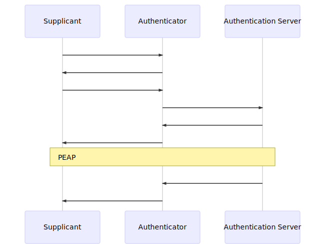
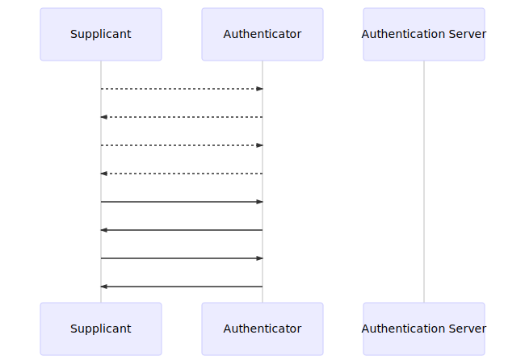

# Schemi di autenticazione

## unitn-x: PEAP-MSCHAPv2

Nota: è implicita la fase di associazione e autorizzazione.



**EAPOL Start**

```
Ethernet II
    Destination: Cisco_2e:a9:91 (c0:7b:bc:2e:a9:91)
    Source: Azurewav_a1:53:4d (74:c6:3b:a1:53:4d)
    Type: 802.1X Authentication (0x888e)
802.1X Authentication
    Version: 802.1X-2001 (1)
    Type: Start (1)
    Length: 0
```

**EAP Request, Identity**

```
Ethernet II
    Destination: Azurewav_a1:53:4d (74:c6:3b:a1:53:4d)
    Source: Cisco_2e:82:01 (c0:7b:bc:2e:82:01)
    Type: 802.1X Authentication (0x888e)
802.1X Authentication
    Version: 802.1X-2004 (2)
    Type: EAP Packet (0)
    Length: 49
Extensible Authentication Protocol
    Code: Request (1)
    Id: 1
    Length: 49
    Type: Identity (1)
    Identity: 
```

**EAP Response, Identity**

```
Ethernet II
    Destination: Cisco_2e:82:01 (c0:7b:bc:2e:82:01)
    Source: Azurewav_a1:53:4d (74:c6:3b:a1:53:4d)
    Type: 802.1X Authentication (0x888e)
802.1X Authentication
    Version: 802.1X-2001 (1)
    Type: EAP Packet (0)
    Length: 28
Extensible Authentication Protocol
    Code: Response (2)
    Id: 1
    Length: 28
    Type: Identity (1)
    Identity: andrea.stedile@unitn.it
```

**EAP Request, Protected EAP (EAP-PEAP)**

```
Ethernet II
    Destination: Azurewav_a1:53:4d (74:c6:3b:a1:53:4d)
    Source: Cisco_2e:82:01 (c0:7b:bc:2e:82:01)
    Type: 802.1X Authentication (0x888e)
802.1X Authentication
    Version: 802.1X-2004 (2)
    Type: EAP Packet (0)
    Length: 6
Extensible Authentication Protocol
    Code: Request (1)
    Id: 2
    Length: 6
    Type: Protected EAP (EAP-PEAP) (25)
    EAP-TLS Flags: 0x20
```

**EAP Success**

```
Ethernet II
    Destination: Azurewav_a1:53:4d (74:c6:3b:a1:53:4d)
    Source: Cisco_2e:82:01 (c0:7b:bc:2e:82:01)
    Type: 802.1X Authentication (0x888e)
802.1X Authentication
    Version: 802.1X-2004 (2)
    Type: EAP Packet (0)
    Length: 4
Extensible Authentication Protocol
    Code: Success (3)
    Id: 14
    Length: 4
```

**EAPOL Key (Message 1 of 4)**

```
Ethernet II
    Destination: Azurewav_a1:53:4d (74:c6:3b:a1:53:4d)
    Source: Cisco_2e:82:01 (c0:7b:bc:2e:82:01)
    Type: 802.1X Authentication (0x888e)
802.1X Authentication
    Version: 802.1X-2004 (2)
    Type: Key (3)
    Length: 117
    Key Descriptor Type: EAPOL RSN Key (2)
    [Message number: 1]
    Key Information: 0x008a
    Key Length: 16
    Replay Counter: 0
    WPA Key Nonce: db0ec658a8e50ccf3851b00a2f551596eca07514f0bc66bd...
    Key IV: 00000000000000000000000000000000
    WPA Key RSC: 0000000000000000
    WPA Key ID: 0000000000000000
    WPA Key MIC: 00000000000000000000000000000000
    WPA Key Data Length: 22
    WPA Key Data: dd14000fac040300d8c9e641ac6ce90113ce1efd8a8d
```

**EAPOL Key (Message 2 of 4)**

```
Ethernet II
    Destination: Cisco_2e:82:01 (c0:7b:bc:2e:82:01)
    Source: Azurewav_a1:53:4d (74:c6:3b:a1:53:4d)
    Type: 802.1X Authentication (0x888e)
802.1X Authentication
    Version: 802.1X-2001 (1)
    Type: Key (3)
    Length: 117
    Key Descriptor Type: EAPOL RSN Key (2)
    [Message number: 2]
    Key Information: 0x010a
    Key Length: 0
    Replay Counter: 0
    WPA Key Nonce: cdfc7d9701e33d3f30853c099d59dddb93a0690395077b60...
    Key IV: 00000000000000000000000000000000
    WPA Key RSC: 0000000000000000
    WPA Key ID: 0000000000000000
    WPA Key MIC: c5bff902008e6f86238769bf1f6d8046
    WPA Key Data Length: 22
    WPA Key Data: 30140100000fac040100000fac040100000fac010000
```

**EAPOL Key (Message 3 of 4)**

```
Ethernet II
    Destination: Azurewav_a1:53:4d (74:c6:3b:a1:53:4d)
    Source: Cisco_2e:82:01 (c0:7b:bc:2e:82:01)
    Type: 802.1X Authentication (0x888e)
802.1X Authentication
    Version: 802.1X-2004 (2)
    Type: Key (3)
    Length: 151
    Key Descriptor Type: EAPOL RSN Key (2)
    [Message number: 3]
    Key Information: 0x13ca
    Key Length: 16
    Replay Counter: 1
    WPA Key Nonce: db0ec658a8e50ccf3851b00a2f551596eca07514f0bc66bd...
    Key IV: 00000000000000000000000000000000
    WPA Key RSC: 0000000000000000
    WPA Key ID: 0000000000000000
    WPA Key MIC: 0e3aededd12dcb59860c4fc4c081e50d
    WPA Key Data Length: 56
    WPA Key Data: 0df4211c61e75238fce8e32065a540711ba4572e85cb8f57...
```

**EAPOL Key (Message 4 of 4)**

```
Ethernet II
    Destination: Cisco_2e:82:01 (c0:7b:bc:2e:82:01)
    Source: Azurewav_a1:53:4d (74:c6:3b:a1:53:4d)
    Type: 802.1X Authentication (0x888e)
802.1X Authentication
    Version: 802.1X-2001 (1)
    Type: Key (3)
    Length: 95
    Key Descriptor Type: EAPOL RSN Key (2)
    [Message number: 4]
    Key Information: 0x030a
    Key Length: 0
    Replay Counter: 1
    WPA Key Nonce: 000000000000000000000000000000000000000000000000...
    Key IV: 00000000000000000000000000000000
    WPA Key RSC: 0000000000000000
    WPA Key ID: 0000000000000000
    WPA Key MIC: 0fc945f27a3bf0ca0239e96a13fcbaa2
    WPA Key Data Length: 0
```

## WPA2-PSK

Cattura effettuata in monitor mode.



**Authentication**

```
IEEE 802.11 Authentication, Flags: ........C
    Type/Subtype: Authentication (0x000b)
    Frame Control Field: 0xb000
        .... ..00 = Version: 0
        .... 00.. = Type: Management frame (0)
        1011 .... = Subtype: 11
        Flags: 0x00
    .000 0001 0011 1010 = Duration: 314 microseconds
    Receiver address: Technico_1c:85:0b (e0:b9:e5:1c:85:0b)
    Destination address: Technico_1c:85:0b (e0:b9:e5:1c:85:0b)
    Transmitter address: HonHaiPr_cb:c5:42 (38:b1:db:cb:c5:42)
    Source address: HonHaiPr_cb:c5:42 (38:b1:db:cb:c5:42)
    BSS Id: Technico_1c:85:0b (e0:b9:e5:1c:85:0b)
    .... .... .... 0000 = Fragment number: 0
    0000 0000 0000 .... = Sequence number: 0
    Frame check sequence: 0x9f5b76ac [correct]
    [FCS Status: Good]
IEEE 802.11 wireless LAN
    Fixed parameters (6 bytes)
```

**Authentication**

```
IEEE 802.11 Authentication, Flags: ........C
    Type/Subtype: Authentication (0x000b)
    Frame Control Field: 0xb000
        .... ..00 = Version: 0
        .... 00.. = Type: Management frame (0)
        1011 .... = Subtype: 11
        Flags: 0x00
    .000 0001 0011 1010 = Duration: 314 microseconds
    Receiver address: HonHaiPr_cb:c5:42 (38:b1:db:cb:c5:42)
    Destination address: HonHaiPr_cb:c5:42 (38:b1:db:cb:c5:42)
    Transmitter address: Technico_1c:85:0b (e0:b9:e5:1c:85:0b)
    Source address: Technico_1c:85:0b (e0:b9:e5:1c:85:0b)
    BSS Id: Technico_1c:85:0b (e0:b9:e5:1c:85:0b)
    .... .... .... 0000 = Fragment number: 0
    0100 1110 1011 .... = Sequence number: 1259
    Frame check sequence: 0x5a8f6136 [correct]
    [FCS Status: Good]
IEEE 802.11 wireless LAN
    Fixed parameters (6 bytes)
    Tagged parameters (11 bytes)
```

**Association request**

```
IEEE 802.11 Association Request, Flags: ........C
    Type/Subtype: Association Request (0x0000)
    Frame Control Field: 0x0000
        .... ..00 = Version: 0
        .... 00.. = Type: Management frame (0)
        0000 .... = Subtype: 0
        Flags: 0x00
    .000 0001 0011 1010 = Duration: 314 microseconds
    Receiver address: Technico_1c:85:0b (e0:b9:e5:1c:85:0b)
    Destination address: Technico_1c:85:0b (e0:b9:e5:1c:85:0b)
    Transmitter address: HonHaiPr_cb:c5:42 (38:b1:db:cb:c5:42)
    Source address: HonHaiPr_cb:c5:42 (38:b1:db:cb:c5:42)
    BSS Id: Technico_1c:85:0b (e0:b9:e5:1c:85:0b)
    .... .... .... 0000 = Fragment number: 0
    0000 0000 0001 .... = Sequence number: 1
    Frame check sequence: 0xd09e8652 [correct]
    [FCS Status: Good]
IEEE 802.11 wireless LAN
    Fixed parameters (4 bytes)
    Tagged parameters (107 bytes)
        Tag: SSID parameter set: TIM-85755147
            Tag Number: SSID parameter set (0)
            Tag length: 12
            SSID: TIM-85755147
        Tag: Supported Rates 1(B), 2(B), 5.5(B), 11(B), 18, 24, 36, 54, [Mbit/sec]
        Tag: Extended Supported Rates 6, 9, 12, 48, [Mbit/sec]
        Tag: RSN Information
        Tag: Vendor Specific: Microsoft Corp.: WMM/WME: Information Element
        Tag: HT Capabilities (802.11n D1.10)
        Tag: RM Enabled Capabilities (5 octets)
        Tag: Extended Capabilities (9 octets)
```

**Association response**

```
IEEE 802.11 Association Response, Flags: ........C
    Type/Subtype: Association Response (0x0001)
    Frame Control Field: 0x1000
        .... ..00 = Version: 0
        .... 00.. = Type: Management frame (0)
        0001 .... = Subtype: 1
        Flags: 0x00
    .000 0001 0011 1010 = Duration: 314 microseconds
    Receiver address: HonHaiPr_cb:c5:42 (38:b1:db:cb:c5:42)
    Destination address: HonHaiPr_cb:c5:42 (38:b1:db:cb:c5:42)
    Transmitter address: Technico_1c:85:0b (e0:b9:e5:1c:85:0b)
    Source address: Technico_1c:85:0b (e0:b9:e5:1c:85:0b)
    BSS Id: Technico_1c:85:0b (e0:b9:e5:1c:85:0b)
    .... .... .... 0000 = Fragment number: 0
    0100 1110 1100 .... = Sequence number: 1260
    Frame check sequence: 0x6fca2ed6 [correct]
    [FCS Status: Good]
IEEE 802.11 wireless LAN
    Fixed parameters (6 bytes)
    Tagged parameters (157 bytes)
        Tag: Supported Rates 1(B), 2(B), 5.5(B), 11(B), 18, 24, 36, 54, [Mbit/sec]
        Tag: Extended Supported Rates 6, 9, 12, 48, [Mbit/sec]
        Tag: HT Capabilities (802.11n D1.10)
        Tag: HT Information (802.11n D1.10)
        Tag: Overlapping BSS Scan Parameters
        Tag: Extended Capabilities (8 octets)
        Tag: Vendor Specific: Microsoft Corp.: WPS
        Tag: Vendor Specific: Broadcom
        Tag: Vendor Specific: Microsoft Corp.: WMM/WME: Parameter Element
```

**EAPOL Key (Message 1 of 4)**

```
IEEE 802.11 QoS Data, Flags: ......F.C
    Type/Subtype: QoS Data (0x0028)
    Frame Control Field: 0x8802
        .... ..00 = Version: 0
        .... 10.. = Type: Data frame (2)
        1000 .... = Subtype: 8
        Flags: 0x02
    .000 0001 0011 1010 = Duration: 314 microseconds
    Receiver address: HonHaiPr_cb:c5:42 (38:b1:db:cb:c5:42)
    Transmitter address: Technico_1c:85:0b (e0:b9:e5:1c:85:0b)
    Destination address: HonHaiPr_cb:c5:42 (38:b1:db:cb:c5:42)
    Source address: Technico_1c:85:0b (e0:b9:e5:1c:85:0b)
    BSS Id: Technico_1c:85:0b (e0:b9:e5:1c:85:0b)
    STA address: HonHaiPr_cb:c5:42 (38:b1:db:cb:c5:42)
    .... .... .... 0000 = Fragment number: 0
    0000 0000 0000 .... = Sequence number: 0
    Frame check sequence: 0xe11997cd [correct]
    [FCS Status: Good]
    Qos Control: 0x0007
Logical-Link Control
    DSAP: SNAP (0xaa)
    SSAP: SNAP (0xaa)
    Control field: U, func=UI (0x03)
    Organization Code: 00:00:00 (Officially Xerox, but
    Type: 802.1X Authentication (0x888e)
802.1X Authentication
    Version: 802.1X-2004 (2)
    Type: Key (3)
    Length: 95
    Key Descriptor Type: EAPOL RSN Key (2)
    [Message number: 1]
    Key Information: 0x008a
    Key Length: 16
    Replay Counter: 1
    WPA Key Nonce: a24e4ec508833dbc8a7288128998f6f81f114c5528d0a0f1...
    Key IV: 00000000000000000000000000000000
    WPA Key RSC: 0000000000000000
    WPA Key ID: 0000000000000000
    WPA Key MIC: 00000000000000000000000000000000
    WPA Key Data Length: 0
```

**EAPOL Key (Message 2 of 4)**

```
IEEE 802.11 QoS Data, Flags: .......TC
    Type/Subtype: QoS Data (0x0028)
    Frame Control Field: 0x8801
        .... ..00 = Version: 0
        .... 10.. = Type: Data frame (2)
        1000 .... = Subtype: 8
        Flags: 0x01
    .000 0000 0110 1010 = Duration: 106 microseconds
    Receiver address: Technico_1c:85:0b (e0:b9:e5:1c:85:0b)
    Transmitter address: HonHaiPr_cb:c5:42 (38:b1:db:cb:c5:42)
    Destination address: Technico_1c:85:0b (e0:b9:e5:1c:85:0b)
    Source address: HonHaiPr_cb:c5:42 (38:b1:db:cb:c5:42)
    BSS Id: Technico_1c:85:0b (e0:b9:e5:1c:85:0b)
    STA address: HonHaiPr_cb:c5:42 (38:b1:db:cb:c5:42)
    .... .... .... 0000 = Fragment number: 0
    0000 0000 0000 .... = Sequence number: 0
    Frame check sequence: 0x7ffc3742 [correct]
    [FCS Status: Good]
    Qos Control: 0x0007
Logical-Link Control
    DSAP: SNAP (0xaa)
    SSAP: SNAP (0xaa)
    Control field: U, func=UI (0x03)
    Organization Code: 00:00:00 (Officially Xerox, but
    Type: 802.1X Authentication (0x888e)
802.1X Authentication
    Version: 802.1X-2001 (1)
    Type: Key (3)
    Length: 117
    Key Descriptor Type: EAPOL RSN Key (2)
    [Message number: 2]
    Key Information: 0x010a
    Key Length: 0
    Replay Counter: 1
    WPA Key Nonce: cdc230534494467ab37ce9e0d42dcc56bc98713f61c24ef4...
    Key IV: 00000000000000000000000000000000
    WPA Key RSC: 0000000000000000
    WPA Key ID: 0000000000000000
    WPA Key MIC: 5b1b079e9e123df43a7b35a85c9d1a96
    WPA Key Data Length: 22
    WPA Key Data: 30140100000fac040100000fac040100000fac020000
```

**EAPOL Key (Message 3 of 4)**

```
IEEE 802.11 QoS Data, Flags: ......F.C
    Type/Subtype: QoS Data (0x0028)
    Frame Control Field: 0x8802
        .... ..00 = Version: 0
        .... 10.. = Type: Data frame (2)
        1000 .... = Subtype: 8
        Flags: 0x02
    .000 0001 0011 1010 = Duration: 314 microseconds
    Receiver address: HonHaiPr_cb:c5:42 (38:b1:db:cb:c5:42)
    Transmitter address: Technico_1c:85:0b (e0:b9:e5:1c:85:0b)
    Destination address: HonHaiPr_cb:c5:42 (38:b1:db:cb:c5:42)
    Source address: Technico_1c:85:0b (e0:b9:e5:1c:85:0b)
    BSS Id: Technico_1c:85:0b (e0:b9:e5:1c:85:0b)
    STA address: HonHaiPr_cb:c5:42 (38:b1:db:cb:c5:42)
    .... .... .... 0000 = Fragment number: 0
    0000 0000 0001 .... = Sequence number: 1
    Frame check sequence: 0xa2cf0789 [correct]
    [FCS Status: Good]
    Qos Control: 0x0007
Logical-Link Control
    DSAP: SNAP (0xaa)
    SSAP: SNAP (0xaa)
    Control field: U, func=UI (0x03)
    Organization Code: 00:00:00 (Officially Xerox, but
    Type: 802.1X Authentication (0x888e)
802.1X Authentication
    Version: 802.1X-2004 (2)
    Type: Key (3)
    Length: 151
    Key Descriptor Type: EAPOL RSN Key (2)
    [Message number: 3]
    Key Information: 0x13ca
    Key Length: 16
    Replay Counter: 2
    WPA Key Nonce: a24e4ec508833dbc8a7288128998f6f81f114c5528d0a0f1...
    Key IV: 00000000000000000000000000000000
    WPA Key RSC: 0000000000000000
    WPA Key ID: 0000000000000000
    WPA Key MIC: 368f2073bf9d86e072fa77da66459a2c
    WPA Key Data Length: 56
    WPA Key Data: 2773279a081db378f2cde830bc5dc9791ee601123f81cec7...
```

**EAPOL Key (Message 4 of 4)**

```
IEEE 802.11 QoS Data, Flags: .......TC
    Type/Subtype: QoS Data (0x0028)
    Frame Control Field: 0x8801
        .... ..00 = Version: 0
        .... 10.. = Type: Data frame (2)
        1000 .... = Subtype: 8
        Flags: 0x01
    .000 0000 0110 1010 = Duration: 106 microseconds
    Receiver address: Technico_1c:85:0b (e0:b9:e5:1c:85:0b)
    Transmitter address: HonHaiPr_cb:c5:42 (38:b1:db:cb:c5:42)
    Destination address: Technico_1c:85:0b (e0:b9:e5:1c:85:0b)
    Source address: HonHaiPr_cb:c5:42 (38:b1:db:cb:c5:42)
    BSS Id: Technico_1c:85:0b (e0:b9:e5:1c:85:0b)
    STA address: HonHaiPr_cb:c5:42 (38:b1:db:cb:c5:42)
    .... .... .... 0000 = Fragment number: 0
    0000 0000 0001 .... = Sequence number: 1
    Frame check sequence: 0x351c3e0d [correct]
    [FCS Status: Good]
    Qos Control: 0x0007
Logical-Link Control
    DSAP: SNAP (0xaa)
    SSAP: SNAP (0xaa)
    Control field: U, func=UI (0x03)
    Organization Code: 00:00:00 (Officially Xerox, but
    Type: 802.1X Authentication (0x888e)
802.1X Authentication
    Version: 802.1X-2001 (1)
    Type: Key (3)
    Length: 95
    Key Descriptor Type: EAPOL RSN Key (2)
    [Message number: 4]
    Key Information: 0x030a
    Key Length: 0
    Replay Counter: 2
    WPA Key Nonce: 000000000000000000000000000000000000000000000000...
    Key IV: 00000000000000000000000000000000
    WPA Key RSC: 0000000000000000
    WPA Key ID: 0000000000000000
    WPA Key MIC: 60fe214bffb1536b8f1ab705e4456a21
    WPA Key Data Length: 0
```